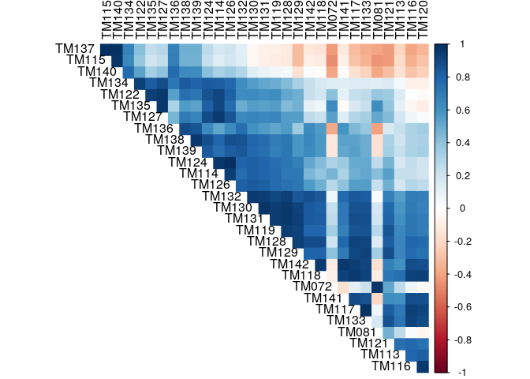
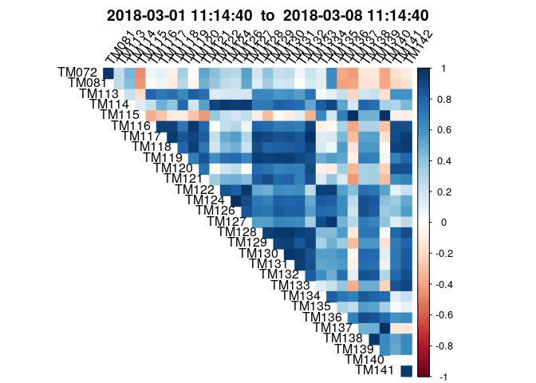
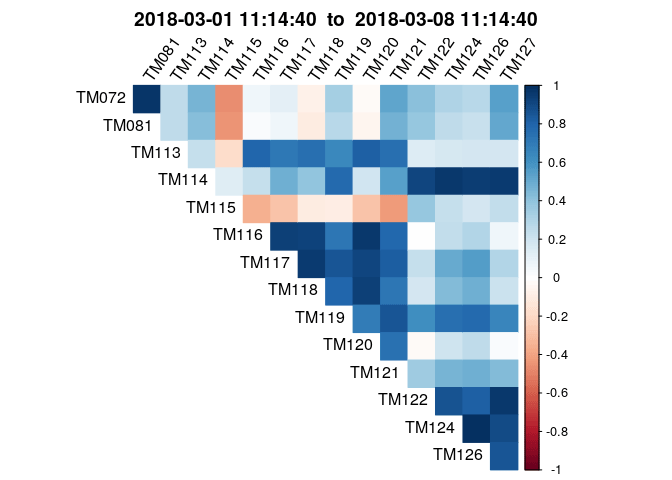
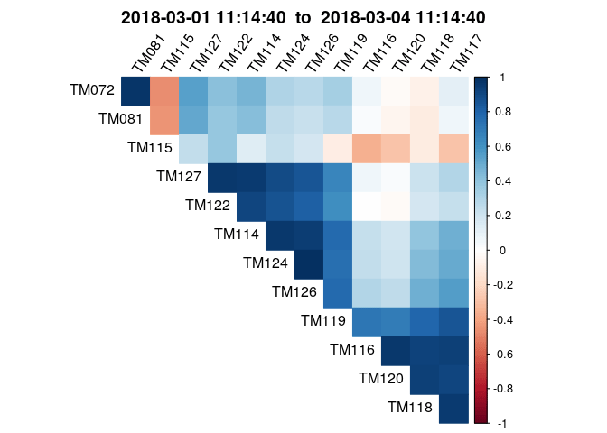
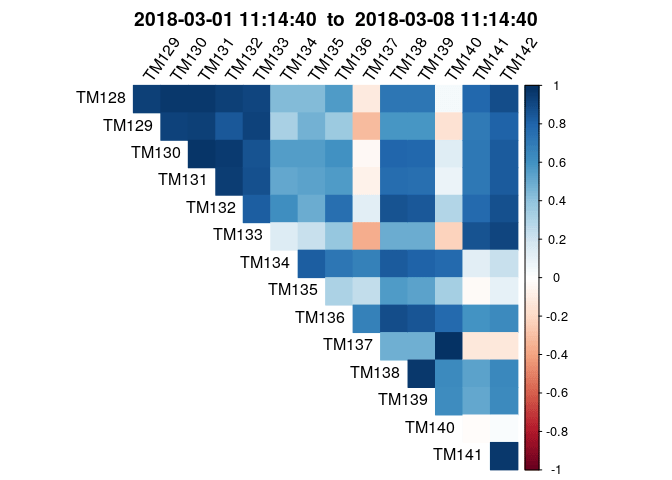
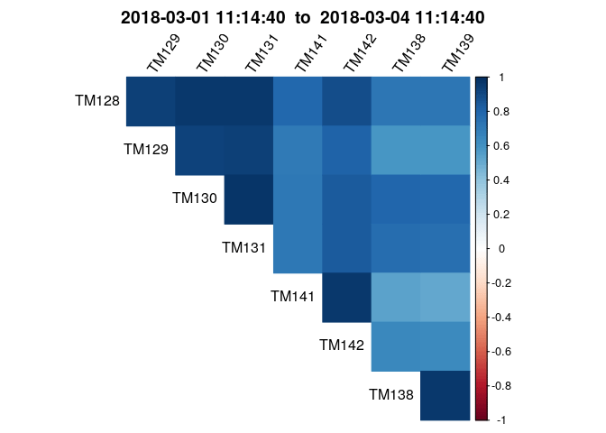

Satellite Telemetry cross relationship analysis
================
Yuri Matheus Dias Pereira and Caio Gustavo Rodrigues da Cruz
12/11/2018

Objectives
==========

This is a simple report on some satellite telemetries relationship using correlations.

Correlation
===========

Let's start with a simple correlalogram between the telemetries.

A problem with the current data is that the time series are not normalized. So we need to normalize the thermistor values, then apply a sliding window correlation matrix to the data to visualize it properly.

For this analysis, we're focusing on all thermistors values, but they can be further separated into subsystems, and will be further in this document.

We're ignoring the invalid CRC checks to not influence in the actual correlation, and with this we have only the actual data that an operator or engineer would see.

Normalize
---------

We are am going with Z-normalization for now, but this might not be much too adequate for this kind of data. However, we'll see as to that in the future.

This aggregated correlation is not as useful, though. Let's try to make a sliding window for it! We're using one week at a time for this one.

While the output is pretty, it doesn't tell us much about the relationship between the temperature readings.

Telemetries
-----------

This section gives an explanation about the telemetries values and their possible relationship. These are grouped by subsystem.

For this notebook, we're focusing only on thermal telemetries. We can see these easily for their thermistor values on the descriptions table, and filtering by the available telemetries at the current frames we get the target telemetries:

    ##  [1] "TM072" "TM081" "TM113" "TM114" "TM115" "TM116" "TM117" "TM118"
    ##  [9] "TM119" "TM120" "TM121" "TM122" "TM124" "TM126" "TM127" "TM128"
    ## [17] "TM129" "TM130" "TM131" "TM132" "TM133" "TM134" "TM135" "TM136"
    ## [25] "TM137" "TM138" "TM139" "TM140" "TM141" "TM142"

Relationships
-------------

### First group

We've separated the set of telemetries into two groups. The first group consists of the following telemetries:

| ID    | DESCRIPTION             | EQP | SYSTEM | TYPE | RANGE       | ACCURACY  |  WORD| BIT | COMMENTS    |
|:------|:------------------------|:----|:-------|:-----|:------------|:----------|-----:|:----|:------------|
| TM072 | Battery temperature 1   | PCU | PSS    | TH   | -3 to 26 C  | +/- 0.3 C |    86| 0   |             |
| TM081 | Battery temperature 2   | PCU | PSS    | TH   | -3 to 26 C  | +/- 0.3 C |    73| 0   |             |
| TM113 | DCP temperature monitor | INT |        | TH   | 6 to 25 C   | +/- 1 C   |    18| 0   | outside box |
| TM114 | MGE temperature monitor | INT |        | TH   | -4 to 29 C  | +/- 1 C   |    20| 0   | outside box |
| TM115 | LP6 temperature monitor | INT |        | TH   | -34 to 36 C | +/- 1 C   |    22| 0   |             |
| TM116 | TR1 temperature monitor | INT |        | TH   | 7 to 27 C   | +/- 1 C   |    24| 0   | outside box |
| TM117 | TR2 temperature monitor | INT |        | TH   | 8 to 26 C   | +/- 1 C   |    26| 0   | outside box |
| TM118 | DEC temperature monitor | INT |        | TH   | 6 to 24 C   | +/- 1 C   |    28| 0   | outside box |
| TM119 | OBC temperature monitor | INT |        | TH   | 5 to 27 C   | +/- 1 C   |    30| 0   | outside box |
| TM120 | ERR temperature monitor | INT |        | TH   | 5 to 28 C   | +/- 1 C   |    32| 0   | outside box |
| TM121 | ENC temperature monitor | INT |        | TH   | 6 to 25 C   | +/- 1 C   |    34| 0   | outside box |
| TM122 | PCU temperature monitor | INT |        | TH   | 4 to 29 C   | +/- 1 C   |    36| 0   | outside box |
| TM124 | SD1 temperature monitor | INT |        | TH   | -4 to 41 C  | +/- 1 C   |    40| 0   | outside box |
| TM126 | SD2 temperature monitor | INT |        | TH   | -3 to 42 C  | +/- 1 C   |    44| 0   | outside box |
| TM127 | BAT temperature monitor | INT |        | TH   | -2 to 20 C  | +/- 1 C   |    46| 0   | outside box |

Let's visualize the correlogram between the telemetries of the first group, initially without any grouping or ordering between telemetries:

Now, based on the telemetries that presented negative correlations we will reorder the sequence of the telemetries to try to group them by the type of correlation and to approximate the negative correlations in the graph.

Grouping the telemetries by negative correlations, we observed that the negatively corrected telemetries are separated between two groups formed by Group 1 (TM072, TM081) and Group 2 (TM115, TM122 and TM127).

As the time progresses the groups present inverse correlations. When Group 1 presents negative correlations Group 2 in some cases has positive correlation and vice versa.

Group 1 is formed by the temperature telemetry of the batteries while the other group has the temperature of the Power Conditionning Unit (PCU - TM122), responsible for:

-To keep the main bus voltage during eclipse or the illuminated parts of the orbit; -To control the dissipation of the excess generated power; -To provide charge current to the battery.

We can interpret the negative correlation formed between these two groups as being a state in which the satellite is in eclipse, and the PCU subsystem works to keep a constant voltage on the satellite's main bus or decays the excess current present in the battery, while the temperature of the satellite PCU may present low values due to eclipse the temperatures of the batteries may present higher values due to their discharge.

### Second group

This is a visualization for the second group of telemetries. The second group is made of these telemetries:

| ID    | DESCRIPTION                    | EQP | SYSTEM | TYPE | RANGE       | ACCURACY |  WORD| BIT | COMMENTS    |
|:------|:-------------------------------|:----|:-------|:-----|:------------|:---------|-----:|:----|:------------|
| TM128 | DCC temperature monitor        | INT |        | TH   | 7 to 27 C   | +/- 1 C  |    19| 0   | outside box |
| TM129 | RDU temperature monitor        | INT |        | TH   | 5 to 24 C   | +/- 1 C  |    21| 0   | outside box |
| TM130 | SS1 temperature monitor        | INT |        | TH   | 5 to 26 C   | +/- 1 C  |    23| 0   | outside box |
| TM131 | SS2 temperature monitor        | INT |        | TH   | 5 to 26 C   | +/- 1 C  |    25| 0   | outside box |
| TM132 | CP inf. temperature monitor    | INT |        | TH   | -1 to 27 C  | +/- 1 C  |    27| 0   |             |
| TM133 | CP sup. temperature monitor    | INT |        | TH   | -1 to 27 C  | +/- 1 C  |    29| 0   |             |
| TM134 | BP temper. monitor (near BAT)  | INT |        | TH   | -17 to 30 C | +/- 1 C  |    31| 0   |             |
| TM135 | BP temper. monitor (near PCU)  | INT |        | TH   | -17 to 30 C | +/- 1 C  |    33| 0   |             |
| TM136 | TP temperature monitor         | INT |        | TH   | -12 to 24 C | +/- 1 C  |    35| 0   |             |
| TM137 | LP2 temperature monitor        | INT |        | TH   | -34 to 36 C | +/- 1 C  |    37| 0   |             |
| TM138 | +X spin TC temperature monitor | INT |        | TH   | -25 to 36 C | +/- 1 C  |    39| 0   |             |
| TM139 | -Y spin TC temperature monitor | INT |        | TH   | -25 to 36 C | +/- 1 C  |    41| 0   |             |
| TM140 | SCE temperature monitor        | SCE |        | TH   | -39 to 34 C | +/- 1 C  |    43| 0   |             |
| TM141 | Axis TQC temperature monitor   | INT |        | TH   | -1 to 22 C  | +/- 1 C  |    45| 0   | outside box |
| TM142 | NDP temperature monitor        | INT |        | TH   | -3 to 21 C  | +/- 1 C  |    47| 0   | outside box |

Selecting the output only for this group, we see some interesting results.

From the documentation, we know that all of these temperatures are internal equipment temperatures, meaning that none of them are outside of the satellite, exposed to the vacuum of space, but inside the satellite structure, and as such all of these telemetries "on the skin" of the equipments.

The notable exception might be the Solar Cell Experiment (SCE), which is located closer to the satellite outer shell.

We can also know that some relationship between similar equipments is expected. For example, a relationship between the Battery Charge Regulator (BCR) and the battery temperatures is expected.

Let's try to group the visualization by the closely related telemetries:

We can see a clear positive correlation trend, but that's expected. Following the documentation:

| ID    | DESCRIPTION                    | EQP | SYSTEM | TYPE | RANGE       | ACCURACY |  WORD| BIT | COMMENTS    |
|:------|:-------------------------------|:----|:-------|:-----|:------------|:---------|-----:|:----|:------------|
| TM128 | DCC temperature monitor        | INT |        | TH   | 7 to 27 C   | +/- 1 C  |    19| 0   | outside box |
| TM129 | RDU temperature monitor        | INT |        | TH   | 5 to 24 C   | +/- 1 C  |    21| 0   | outside box |
| TM130 | SS1 temperature monitor        | INT |        | TH   | 5 to 26 C   | +/- 1 C  |    23| 0   | outside box |
| TM131 | SS2 temperature monitor        | INT |        | TH   | 5 to 26 C   | +/- 1 C  |    25| 0   | outside box |
| TM138 | +X spin TC temperature monitor | INT |        | TH   | -25 to 36 C | +/- 1 C  |    39| 0   |             |
| TM139 | -Y spin TC temperature monitor | INT |        | TH   | -25 to 36 C | +/- 1 C  |    41| 0   |             |
| TM141 | Axis TQC temperature monitor   | INT |        | TH   | -1 to 22 C  | +/- 1 C  |    45| 0   | outside box |
| TM142 | NDP temperature monitor        | INT |        | TH   | -3 to 21 C  | +/- 1 C  |    47| 0   | outside box |

DCC and RDU are related to power, so they're close together. The SS1 are the solar sensors, which are closer to the shell of the satellite, and thus have a slighly lower correlation to the rest of the equipments. +X and -Y spin axis are related to the TT&C, and are localted on the same equipment.

<!--
# SAX + Apriori

After having seen these telemetries and the relationships, we're now ready to move to the next step, and apply the SAX and Apriori algorithms to the data.

-->
